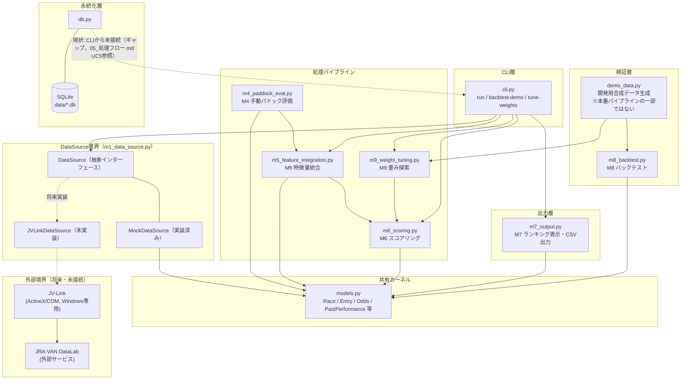
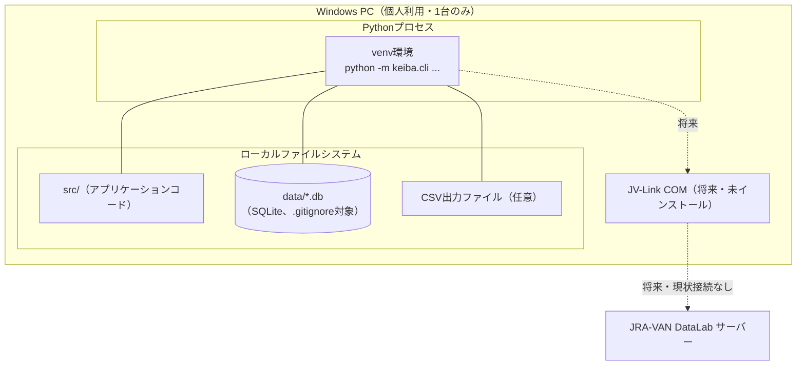

# アーキテクチャ設計

| 項目 | 内容 |
|---|---|
| 更新日 | 2026-08-07 |

## 1. 概要

本ツールはPython製のローカルCLIスクリプトであり、Windows PC 1台の上で完結する。サーバープロセスは持たず、外部への待受ポートも無い。将来（Phase 1後半以降）JV-Link経由でJRA-VAN DataLabに接続する場合のみ、ローカルPCから外部サービスへの通信が発生する（現状は未接続）。

## 2. コンポーネント図

## 3. デプロイメント図

- サーバープロセス、待受ポート、コンテナは存在しない。
- ネットワーク経路は現状ゼロ。将来JV-Link接続を実装した場合のみ、ローカルPC→JRA-VAN DataLabの通信が発生する（要件定義書 12.1-2, 12.3）。

## 4. コンポーネント責務一覧

| コンポーネント | ファイル | 責務 | 主な依存先 |
|---|---|---|---|
| CLI層 | `src/keiba/cli.py` | コマンドライン引数の解釈、各モジュールの呼び出し順序の制御 | 下記すべて |
| DataSourceインターフェース | `src/keiba/m1_data_source.py` | 基礎データ取得の抽象化（M1） | `models.py` |
| M4 手動パドック評価 | `src/keiba/m4_paddock_eval.py` | パドック評価の入力・バリデーション | `models.py` |
| M5 特徴量統合 | `src/keiba/m5_feature_integration.py` | 各データソースの結合、派生特徴量算出 | `m1_data_source.py`, `models.py` |
| M6 スコアリング | `src/keiba/m6_scoring.py` | 重み付けによるスコア算出・ランキング | `m5_feature_integration.py` |
| M7 出力 | `src/keiba/m7_output.py` | ランキング表示、買い目候補、CSV出力 | `m6_scoring.py` |
| M8 バックテスト | `src/keiba/m8_backtest.py` | 過去データへの適用、的中率・回収率算出 | `m6_scoring.py`, `models.py` |
| M9 重み探索 | `src/keiba/m9_weight_tuning.py` | M6重みのランダムサーチ | `m6_scoring.py`, `m8_backtest.py` |
| 開発用合成データ | `src/keiba/demo_data.py` | 実データ入手までのパイプライン動作確認用データ生成 | `m1_data_source.py`, `m5_feature_integration.py` |
| 永続化層 | `src/keiba/db.py` | SQLiteスキーマ定義、保存・読込関数 | `models.py` |
| 共有カーネル | `src/keiba/models.py` | 全モジュール共通のデータモデル（dataclass） | なし |

## 5. 既知のアーキテクチャ上のギャップ

- **永続化層が未接続**: `db.py`は実装済みだが、`cli.py`のどのサブコマンドからも呼び出されていない。`run`実行のたびにMockDataSourceから毎回同じ架空データを読み直しており、DBへの保存・読込は行われていない（要件定義書 §7で謳った「ローカルDBにレース結果・特徴量・予測ログを蓄積する」という非機能要件が未達）。
- **JVLinkDataSourceは未実装**: JRA-VAN契約・JV-Link利用キー取得後に着手する（要件定義書 12.1-2, 12.3）。
