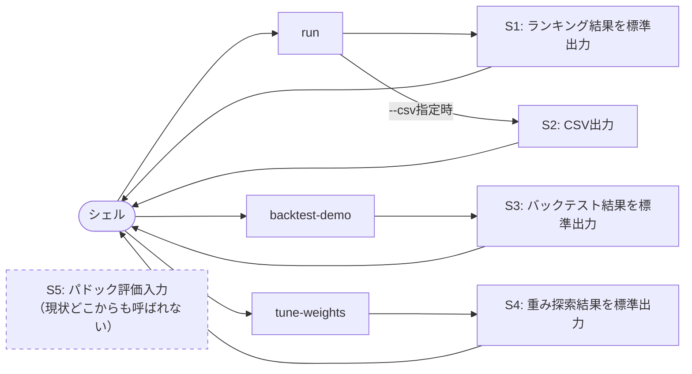

# 画面設計

## 前提

Phase 1ではブラウザUI（Streamlit等）を採用せず、CLIのテキスト出力とCSVファイルを「画面」として扱う。本書では、各コマンド実行時の標準出力レイアウトを画面として定義する。

## 1. 画面一覧

| # | 画面名 | 呼び出し方 | 実装箇所 |
|---|---|---|---|
| S1 | ランキング結果画面 | `python -m keiba.cli run` | `m7_output.print_report`（`format_ranking_table` + `format_bet_recommendation`） |
| S2 | CSV出力ファイル | `python -m keiba.cli run --csv <path>` | `m7_output.export_csv` |
| S3 | バックテスト結果画面 | `python -m keiba.cli backtest-demo` | `m8_backtest.format_backtest_report` |
| S4 | 重み探索結果画面 | `python -m keiba.cli tune-weights` | `m9_weight_tuning.format_tuning_summary` |
| S5 | パドック評価 対話入力画面（**ギャップ**） | なし（未接続） | `m4_paddock_eval.prompt_score_cli` |

> **S5について**: `prompt_score_cli`関数は実装済みだが、`cli.py`のどのサブコマンドからも呼び出されていない。現状`run`は常に`paddock_scores=None`（未評価）でスコアリングを行っており、M4の評価結果を実際にスコアへ反映する経路が存在しない。要件定義書 12.1「手動パドック評価の採点基準の具体化」が完了した後、CLIへの接続もあわせて対応する必要がある。

## 2. 画面遷移



各コマンドは独立しており、統一メニューは存在しない。1コマンド=1回の実行で結果を出力し、シェルに制御が戻る単純な構造。

## 3. 主要画面

### S1: ランキング結果画面（`run`）

実際のフォーマット（`m7_output.format_ranking_table` / `format_bet_recommendation`）に基づくモックアップ:

```
=== SAMPLE-2026-01 予想ランキング ===
  順位   馬番 馬名                 スコア  内訳(パドック/オッズ/近走成績/クラス昇降/騎手/馬体重/調教師)
   1    1 サンプルホースA         70.88   17.5/ 25.0/ 12.0/  0.0/  8.0/  3.4/  5.0
   2    2 サンプルホースB         48.70   17.5/ 13.5/  2.7/  5.0/  3.2/  5.0/  1.9
   3    3 サンプルホースC         27.50   17.5/  0.0/  0.0/ 10.0/  0.0/  0.0/  0.0

--- 買い目候補（暫定ロジック） ---
単勝: [1]
複勝: [1, 2]
馬連(BOX): [[1, 2], [1, 3], [2, 3]]
```

内訳の列見出しはM6の`breakdown`辞書のキーから動的に生成されるため、M6にファクターを追加・削除しても本画面の実装は変更不要（`m7_output._factor_keys`参照）。

### S3: バックテスト結果画面（`backtest-demo`）

```
※ 実過去データが未入手のため、合成データでパイプラインの動作確認のみ行います。
=== バックテスト結果（対象レース数: 20） ===
単勝: 20件中16件的中（的中率80.0%, 回収率453.7%）
複勝: 40件中31件的中（的中率77.5%, 回収率277.2%）
```

### S4: 重み探索結果画面（`tune-weights`）

```
※ 合成データは『オッズを基準にした疑似的な強さ』で結果を生成しているため、
この探索は『オッズを最重視すべき』という自明な結論に偏ります。
仕組みの動作確認用であり、実際の重み調整には実過去データが必要です。

=== 現行重み(DEFAULT_WEIGHTS) ===
単勝回収率= 421.1% 的中率= 73.3%  重み: paddock=0.35, odds=0.25, recent_form=0.12, class_fit=0.10, jockey=0.08, weight_stability=0.05, trainer=0.05

=== ランダムサーチ上位5件（全300件中） ===
1. 単勝回収率= 479.0% 的中率= 70.0%  重み: paddock=0.36, odds=0.29, recent_form=0.03, class_fit=0.11, jockey=0.10, weight_stability=0.06, trainer=0.05
...
```

### S2: CSV出力ファイル

`export_csv`が生成する列は`rank, horse_number, horse_name, total_score`に続けて、M6の`breakdown`キー（`paddock, odds, recent_form, class_fit, jockey, weight_stability, trainer`）が動的に並ぶ。文字コードはExcelでの文字化けを避けるため`utf-8-sig`。
