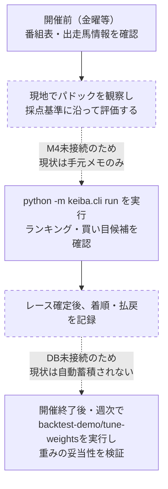
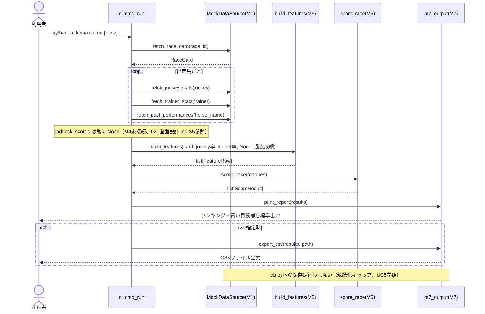
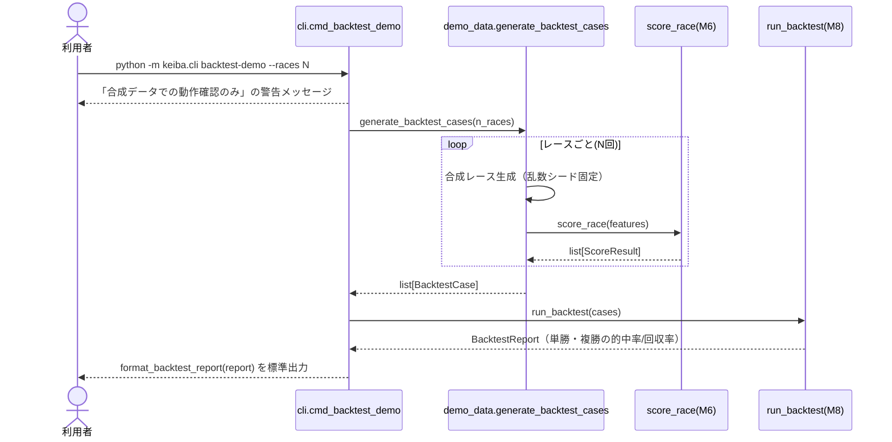
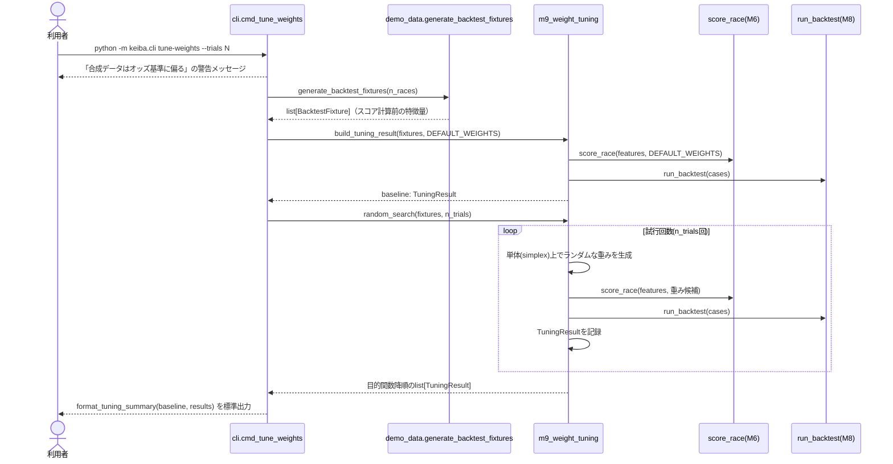
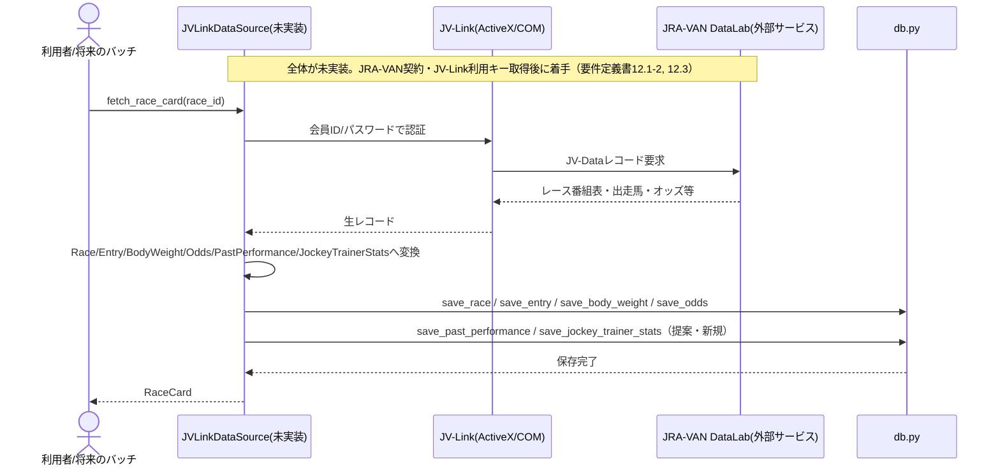
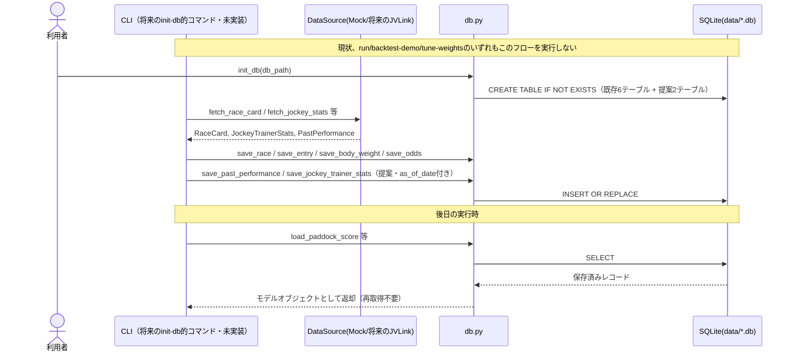
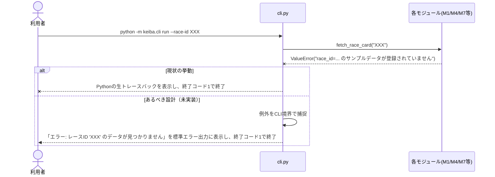

# 処理フロー（主要ユースケースのシーケンス図）

| 項目 | 内容 |
|---|---|
| 更新日 | 2026-08-07 |

## UC0: 週次運用フロー（利用者視点のサイクル、要件定義書5.8対応）

UC1〜UC5がモジュール間の内部呼び出し順序を示すのに対し、本図は利用者が実際にレース開催の週末をどう過ごすかという運用視点のフローである。破線ノードは現状未接続・未実装のため、実際には機能しないステップを示す。

対応する既知ギャップ: M4のCLI未接続（`04_IF一覧.md`）、DB永続化未接続（`01_アーキテクチャ設計.md` §5、本書UC5）。これら3点が解消されるまで、実際の運用はUC1（`run`単発実行）のみに留まる（要件定義書5.8）。

## UC1: `run` — スコアリング結果の表示（現状の主要フロー）

## UC2: `backtest-demo` — M8バックテスト実行

## UC3: `tune-weights` — M9重み探索実行

## UC4: 将来のJV-Link実データ取得（未実装・設計のみ）

## UC5: DB保存・読込（現状未接続。永続化ギャップを明示する図）

## UC6: エラー処理（異常系）

現状、`cli.py`には例外を捕捉する処理が一切無く、各モジュールが送出した例外はそのままPythonの生トレースバックとして表示され、終了コード1でプロセスが終了する。以下に主要なエラーケースと、現状の挙動・あるべき設計を示す。

### 主要エラーケース一覧

| # | 発生箇所 | 例外 | 現状の挙動 | あるべき設計（未実装） |
|---|---|---|---|---|
| 1 | `DataSource.fetch_race_card` | `ValueError`（race_id未登録） | 生トレースバック表示、終了コード1 | 「エラー: レースID '{race_id}' のデータが見つかりません」を表示し終了コード1 |
| 2 | `m4_paddock_eval.make_score` | `ValueError`（未定義項目／点数範囲外） | 生トレースバック表示（現状CLI未接続のため到達しない） | 該当項目・許容範囲を含む日本語エラーメッセージを表示 |
| 3 | `m7_output.export_csv` | `PermissionError`等（書き込み権限無し） | 生トレースバック表示、終了コード1 | 「エラー: CSV出力に失敗しました: {path}」を表示し終了コード1 |
| 4 | `db.py`（提案・未接続） | `sqlite3.Error`（DB接続失敗・ロック等） | 未到達（DB自体が未接続） | 「エラー: データベースに接続できません」を表示し終了コード1 |
| 5 | `JVLinkDataSource`（未実装） | 未定義 | 未到達（未実装） | JV-Data仕様書入手後、JV-Link COM側のエラーコード体系に合わせて設計する |

**方針**: 個人利用のCLIツールであり利用者は開発者本人でもあるため、終了コードは「正常=0、異常=1」の2値のみで十分と判断し、複雑な終了コード体系（2=データ無し、3=権限エラー等）は導入しない。`cli.py`の`main()`関数内で各サブコマンドの実行を`try/except`で包み、捕捉した例外メッセージを整形して標準エラー出力に表示する設計とする（実装は次回対応、02_画面設計.md S6参照）。
