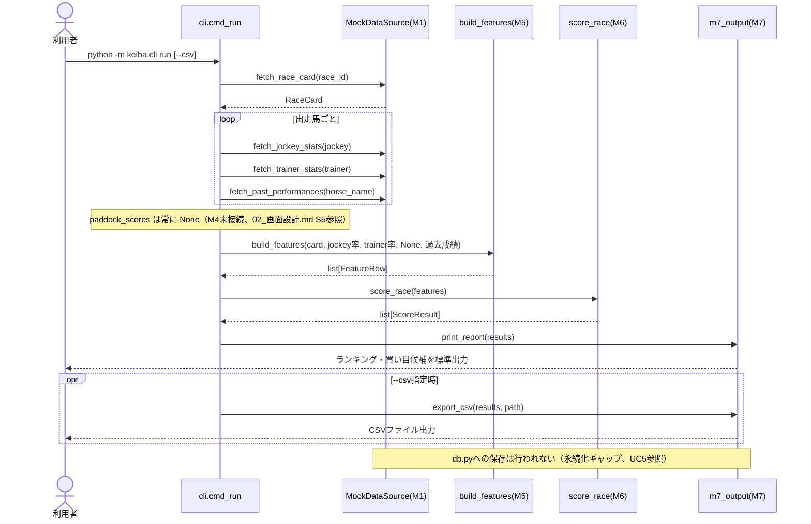
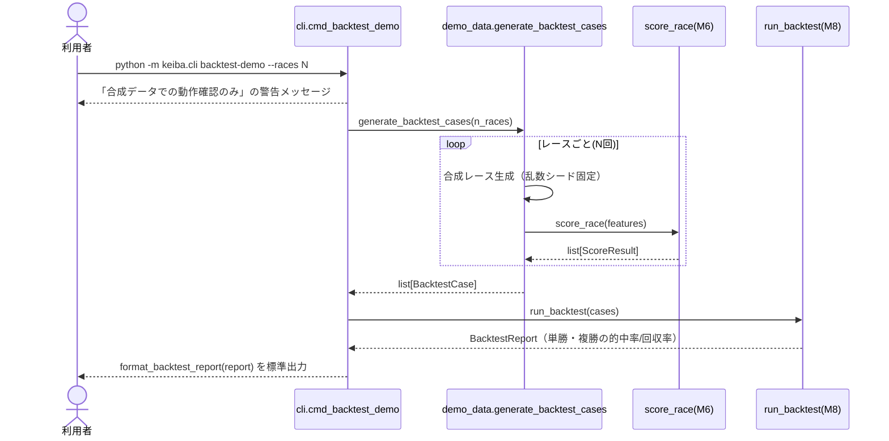
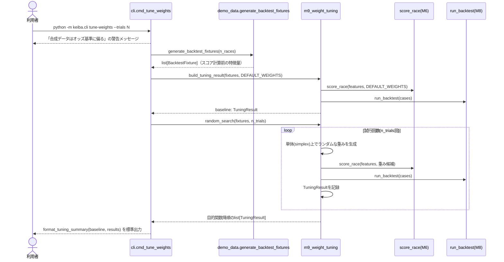
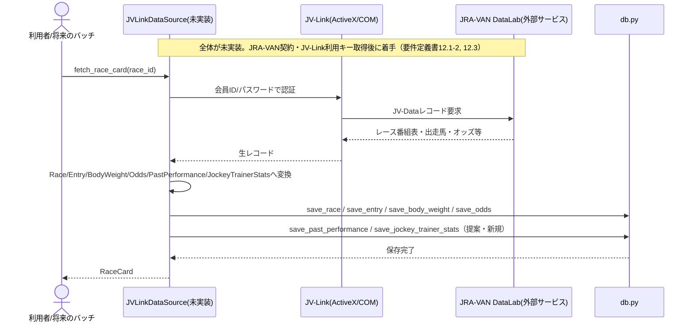
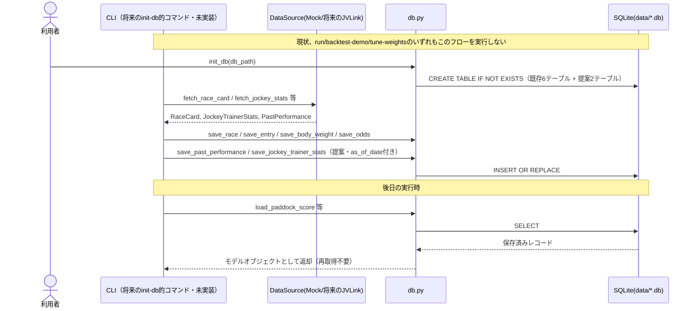

# 処理フロー（主要ユースケースのシーケンス図）

## UC1: `run` — スコアリング結果の表示（現状の主要フロー）

## UC2: `backtest-demo` — M8バックテスト実行

## UC3: `tune-weights` — M9重み探索実行

## UC4: 将来のJV-Link実データ取得（未実装・設計のみ）

## UC5: DB保存・読込（現状未接続。永続化ギャップを明示する図）

